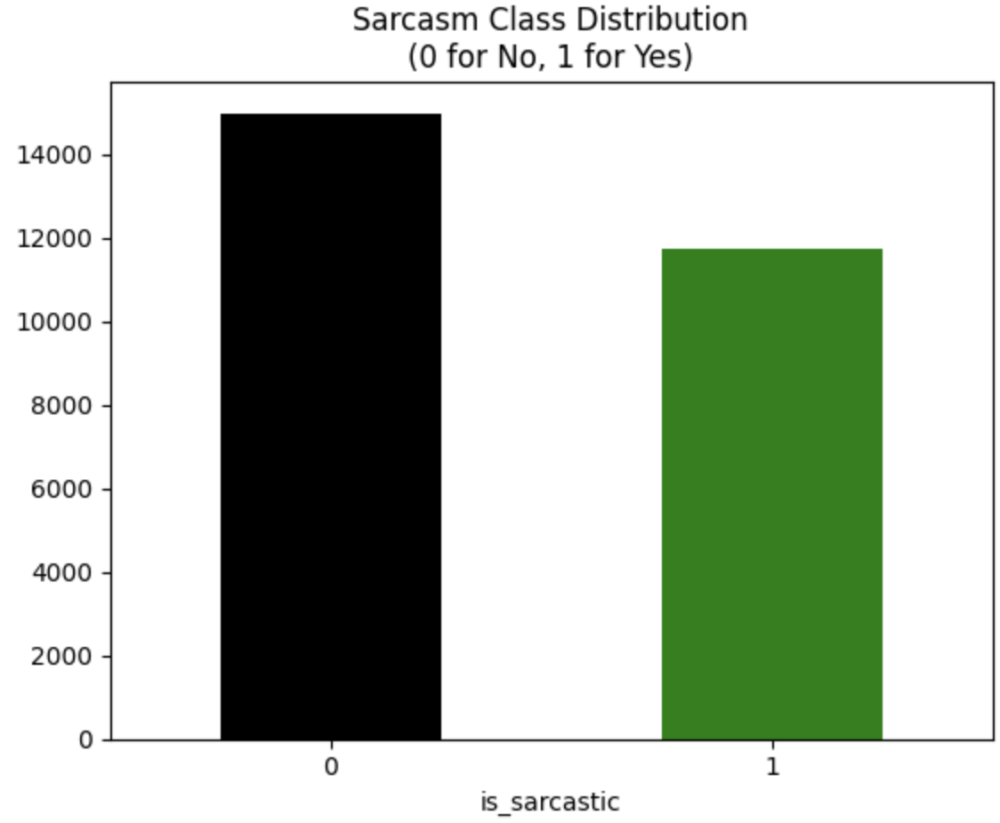
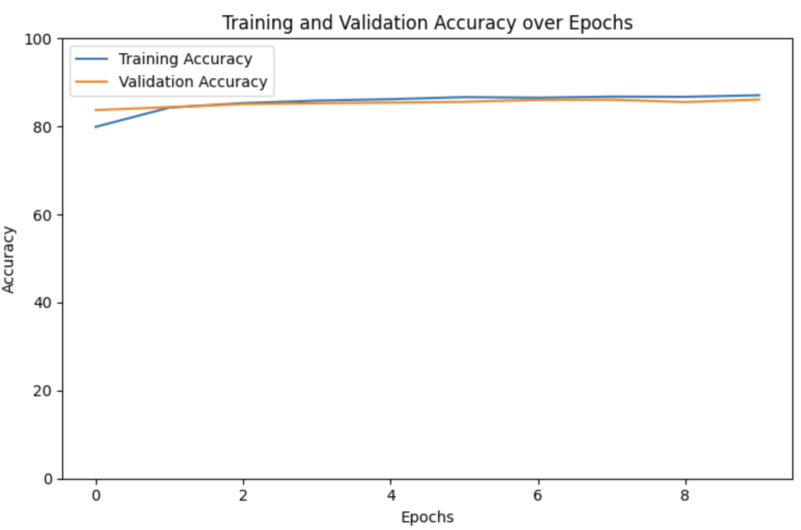

# 📝 Sarcasm Detection — NLP Text Classification

## 📌 Overview

This project analyzes and classifies **news headlines** to detect **sarcasm** using Natural Language Processing (NLP) and Deep Learning with PyTorch and Hugging Face Transformers.

The dataset contains **26,708 news headlines** with two columns after cleaning:

- `headline` → text of the news headline (input)
- `is_sarcastic` → binary label (0 = not sarcastic, 1 = sarcastic)

The goal is to leverage BERT embeddings with a custom neural classifier to determine whether a given headline is sarcastic.

---

## 🎯 Project Objective

Build an NLP-driven classification model to automatically predict sarcasm in news headlines. This enables applications in content moderation, sentiment analysis, and improving contextual understanding in conversational AI.

---

## 🛠️ Project Workflow

| Step | Description |
|------|-------------|
| **1. Data Acquisition** | Loaded Kaggle sarcasm dataset (`sarcasm.json`) with ~27k rows. |
| **2. Data Cleaning** | Removed duplicates, dropped irrelevant `article_link` column → Final dataset shape: (26708, 2). |
| **3. Exploratory Data Analysis (EDA)** | Checked sarcasm vs non-sarcasm distribution. |
| **4. Data Preprocessing** | Tokenized headlines using Hugging Face `bert-base-uncased`. Applied truncation & padding (max_length=100). Split dataset into train (18,695), validation (4,006), and test (4,007). |
| **5. Model Architecture** | Custom PyTorch model: Frozen BERT embeddings → Dropout → Dense(384) → Dense(1, sigmoid). |
| **6. Model Training** | Optimizer: Adam (lr=0.0001). Loss: Binary Cross Entropy. Trained for 10 epochs with batch size 32. |
| **7. Evaluation** | Accuracy measured on validation and test sets. Plots generated for loss and accuracy trends. |

---

## 📊 Exploratory Data Analysis (EDA)

**Class Distribution**

The dataset is relatively balanced between sarcastic and non-sarcastic headlines.

  

---

## 🧩 Model Architecture Summary

| Layer Name   | Layer Type       | Output Shape | Parameters |
|--------------|------------------|--------------|------------|
| bert         | BERT Embeddings  | (None, 100, 768) | 109M |
| dropout      | Dropout (p=0.25) | (None, 768)  | 0 |
| linear1      | Dense            | (None, 384)  | 295,296 |
| linear2      | Dense            | (None, 1)    | 385 |
| sigmoid      | Activation       | (None, 1)    | 0 |

**Total Trainable Params:** ~295k 
**Non-trainable Params:** 109M  

---

## 📊 Model Performance

**Training Progress (10 epochs):**

| Epoch | Train Accuracy | Train Loss | Val Accuracy | Val Loss |
|-------|----------------|------------|--------------|----------|
| 1 | 79.9% | 0.2633 | 83.7% | 0.0477 |
| 3 | 85.3% | 0.2006 | 85.1% | 0.0433 |
| 5 | 86.1% | 0.1889 | 85.4% | 0.0417 |
| 7 | 86.5% | 0.1830 | 86.0% | 0.0406 |
| 10 | 87.1% | 0.1788 | 86.1% | 0.0407 |

**Final Results:**
- Validation Accuracy: ~86%  
- Test Accuracy: ~86%  

  

---

## 💡 Key Insights

- BERT embeddings significantly improved performance compared to traditional word embeddings.  
- Model achieved strong **generalization**, with training and validation accuracy both around 86–87%.  
- Minimal overfitting observed, thanks to dropout regularization and frozen BERT weights.  

---

## ⚠️ Challenges

- **GPU/CPU Constraints**: Training transformer-based models is compute-intensive.  
- Due to Colab GPU limitations and CPU fallback, the model was only trained **once for 10 epochs**.  
- Multiple runs or hyperparameter tuning were not feasible under current compute restrictions.  

---

## 🚀 Potential Improvements

- Fine-tune BERT layers to improve results.
- Experiment with other transformer architectures (RoBERTa, DistilBERT).  
- Perform hyperparameter tuning for better optimization.  
- Deploy as a web API or Streamlit app for real-time sarcasm detection.  

---

## 📦 Tech Stack

- **Languages**: Python 🐍  
- **Libraries**: Pandas, NumPy, Matplotlib, Scikit-learn, PyTorch, Hugging Face Transformers  

---

## 📝 Notes

- Dataset sourced from Kaggle → [News Headlines Dataset for Sarcasm Detection](https://www.kaggle.com/datasets/rmisra/news-headlines-dataset-for-sarcasm-detection)
